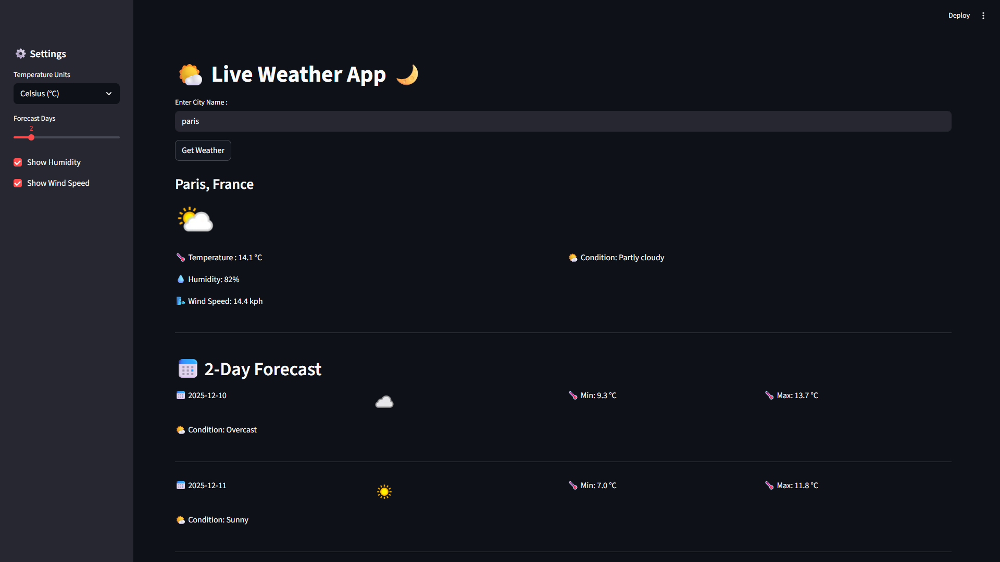

# 🌤️ Live Weather App
A sleek, modern **weather dashboard** built with **Streamlit** and powered by a real-time **Weather API**. This app allows users to search for any city worldwide and instantly view current conditions along with a customizable multi-day forecast.

---

## 📸 Preview
Add a screenshot of your app here:



---

## 🚀 Features

### **🔎 Real-Time Weather Search**
- Enter any city name and fetch live weather data instantly.
- Displays condition, temperature, humidity, and wind speed.

### **📅 Customizable Forecast**
- Choose the number of forecast days.
- View daily conditions with min/max temperature breakdown.

### **⚙️ Settings Panel**
- Switch between **Celsius** and **Fahrenheit**.
- Toggle **humidity** and **wind speed** visibility.
- Intuitive slider for forecast duration.

### **🎨 Modern UI**
- Dark themed, minimalistic, and responsive layout.
- Clean weather icons and clear information hierarchy.

---

## 🛠️ Tech Stack

| Component | Technology |
|----------|------------|
| Frontend UI | Streamlit |
| Weather Data | Weather API |
| Language | Python |
| Deployment | Streamlit Cloud / Local |

---

## 📦 Installation & Setup

### **1️⃣ Clone the repository**
```bash
git clone https://github.com/<your-username>/<your-repo-name>.git
cd <your-repo-name>
```

### **2️⃣ Install dependencies**
```bash
pip install -r requirements.txt
```

### **3️⃣ Add your Weather API key**
Create a `.env` file:
```
WEATHER_API_KEY=your_api_key_here
```

### **4️⃣ Run the Streamlit app**
```bash
streamlit run app.py
```

---

## 🧩 Folder Structure
```
📁 weather-app/
│── app.py               # Main Streamlit application
│── requirements.txt     # Dependencies
│── utils/               # Helper functions
│── assets/              # Icons or images
│── README.md            # Documentation
```

---

## 🔐 API Usage
This project requires an API key from your preferred weather service (OpenWeather, WeatherAPI, etc.).  
Update your API endpoint and key inside the script.

---

## 🌍 Live Demo
If deployed, put your link here:

👉 **[Try the Live Weather App](https://weatherapp-7dwahsgzkewlcxsqczhsvi.streamlit.app/)**

---

## 🤝 Contributing
Contributions are welcome!  
Open issues or submit PRs for improvements.

---

## 📄 License
Licensed under the **MIT License**.

---

## ⭐ Support
If this project helped you, consider giving it a **star** on GitHub!

